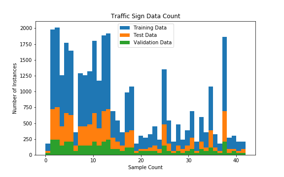

# Project: Build a Traffic Sign Recognition Program

## Overview

In this project, I use deep neural networks and convolutional neural networks to classify traffic signs. I train and validate a model so it can classify traffic sign images using the [German Traffic Sign Dataset](http://benchmark.ini.rub.de/?section=gtsrb&subsection=dataset). After the model is trained, I then try out my model on images of German traffic signs that I find on the web.

## The Goals / Steps of This Project

* Load the data set (see below for links to the project data set)
* Explore, summarize and visualize the data set
* Design, train and test a model architecture
* Use the model to make predictions on new images
* Analyze the softmax probabilities of the new images
* Summarize the results with a written report

## Reflection

### Data Set Summary & Exploration

I use Python to calculate summary statistics of the traffic signs data set:

* The size of training set is 34799
* The size of the validation set is 4410 
* The size of test set is 12630
* The shape of a traffic sign image is 32, 32, 3
* The number of unique classes/labels in the data set is 43

An exploratory visualization of the data is included. It is a bar chart showing how the train data, valid data and test data distributes of classes. X axis shows the number of classes (which is 43). Y axis shows the numbers of each class in the data.

### Design and Test a Model Architecture

#### Preprocess:

* As a first step, I decided to convert the images to grayscale because this reduces the channels from 3 to 1 and will make the process easier.
* Then, I normalized the image data because this keeps variables as close to zero mean and same variance as possible.
* As a last step, I shuffled the train data.

#### Model Architecture

My final model architecture consists of the following layers:

|      Layer      |                 Description                 |
| :-------------: | :-----------------------------------------: |
|      Input      |              32x32x3 RGB image              |
| Convolution 5x5 | 1x1 stride, valid padding, outputs 28x28x6  |
|      RELU       |                                             |
|   Max pooling   |        2x2 stride,  outputs 14x14x6         |
| Convolution 5x5 | 1x1 stride, valid padding, outputs 10x10x16 |
|      RELU       |                                             |
|   Max pooling   |         2x2 stride,  outputs 5x5x16         |
| Fully connected |            Input 400, output 120            |
|      RELU       |                                             |
| Fully connected |            Input 120, output 84             |
|      RELU       |                                             |
| Fully connected |             Input 84, output 43             |
|     Softmax     |                   Output                    |

#### Train The Model

To train the model, I use an Adam optimizer. I set the batch size to 128, number of epochs to 40, learning rate to 0.001.

#### Result

My final model results were:

* validation set accuracy of 0.957 
* test set accuracy of 0.924

#### Discussion

Dropout layers after fully connected layers improves the result significantly. With dropout layers my network will never depend on any given activation to exist, because they may be destroyed at any time, so it is forced to learn all redundant representations to ensure that at least some information is preserved. One activation is shattered but there will always be one or more activations popping up to do the same job. It leads to a better result.

---

### Test a Model on New Images

#### German Traffic Signs

Five German traffic signs found on the web are stored in the following folder ../data/test_images

For the images, they might be difficult to classify because the background contained many other information as well as some same color as the traffic signs.

#### Model's Prediction

Here are the results of the prediction:

|                 Image                 |              Prediction               |
| :-----------------------------------: | :-----------------------------------: |
|             Priority road             |             Priority road             |
| Right-of-way at the next intersection | Right-of-way at the next intersection |
|              Keep right               |              Keep right               |
|            Turn left ahead            |            Turn left ahead            |
|                30km/h                 |                30km/h                 |

The model is able to correctly guess 5 of the 5 traffic signs, which gives an accuracy of 100%. This compares favorably to the accuracy on the test set of 92.4%.

#### Top 5 Softmax Probabilities for Each Image

The code for making predictions on my final model is located in the 17th cell of the Ipython notebook.

For the first image, the model is relatively sure that this is a priority road sign (probability of 1.0), and the image does contain a priority road sign. The top five soft max probabilities were

| Probability |                 Prediction                 |
| :---------: | :----------------------------------------: |
|     1.0     |             Priority road sign             |
|     0.0     |         Roundabout mandatory sign          |
|     0.0     |  End of all speed and passing limits sign  |
|     0.0     | Right-of-way at the next intersection sign |
|     0.0     |           End of no passing sign           |

For the second image, the model is relatively sure that this is a right-of-way at the next intersection sign (probability of 1.0), and the image does contain a right-of-way at the next intersection sign. The top five soft max probabilities were

| Probability |                 Prediction                 |
| :---------: | :----------------------------------------: |
|     1.0     | Right-of-way at the next intersection sign |
|     0.0     |          Beware of ice/snow sign           |
|     0.0     |         Wild animals crossing sign         |
|     0.0     |              Pedestrians sign              |
|     0.0     |             Priority road sign             |

For the third image, the model is relatively sure that this is a keep right sign (probability of 1.0), and the image does contain a keep right sign. The top five soft max probabilities were

| Probability |   Prediction    |
| :---------: | :-------------: |
|     1.0     | Keep right sign |
|     0.0     |   20km/h sign   |
|     0.0     |   30km/h sign   |
|     0.0     |   50km/h sign   |
|     0.0     |   40km/h sign   |

For the fourth image, the model is relatively sure that this is a turn left ahead sign (probability of 1.0), and the image does contain a turn left ahead sign. The top five soft max probabilities were

| Probability |      Prediction      |
| :---------: | :------------------: |
|     1.0     | Turn left ahead sign |
|     0.0     |   Keep right sign    |
|     0.0     |      Yield sign      |
|     0.0     |      Ahead only      |
|     0.0     |     60km/h sign      |

For the fifth image, the model is relatively sure that this is a 30km/h sign (probability of 1.0), and the image does contain a 30km/h sign. The top five soft max probabilities were

| Probability |         Prediction         |
| :---------: | :------------------------: |
|     1.0     |        30km/h sign         |
|     0.0     |        50km/h sign         |
|     0.0     |        80km/h sign         |
|     0.0     |        40km/h sign         |
|     0.0     | Wild animals crossing sign |